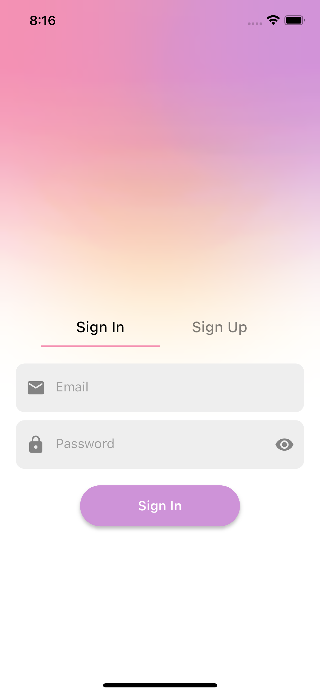
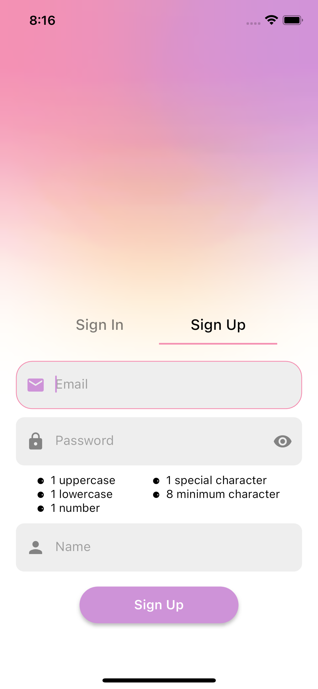
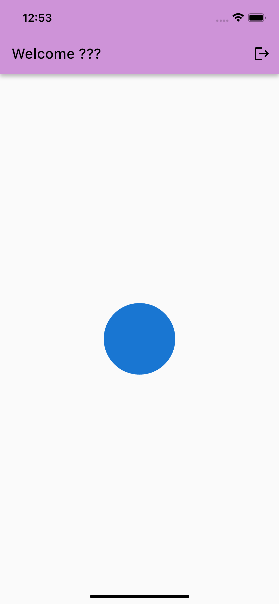
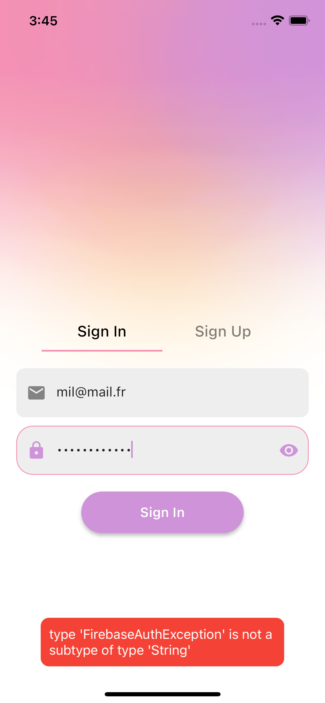

# login_auth_bloc_app

A new Flutter project. Login authentication base using tab for signin and signup with bloc and firebase. add toaster errors and succes.

## Render of App

SignIn, SignUp, Home

     


## Getting Started

This project is a starting point for a Flutter application.

A few resources to get you started if this is your first Flutter project:

- [Lab: Write your first Flutter app](https://docs.flutter.dev/get-started/codelab)
- [Cookbook: Useful Flutter samples](https://docs.flutter.dev/cookbook)

For help getting started with Flutter development, view the
[online documentation](https://docs.flutter.dev/), which offers tutorials,
samples, guidance on mobile development, and a full API reference.


## Prerequisites

[Install dart](https://dart.dev/get-dart)

[Install flutter](https://docs.flutter.dev/get-started/install)


## For Login
user infos 
mail@mail.fr - Test1234@

## Install

Get all packages
```bash
flutter pub get
```


## Install firebase firebase-cli

 0. [Install Firebase](https://firebase.google.com/docs/flutter/setup?authuser=0&hl=fr&platform=ios)

1. Si vous ne l'avez pas déjà fait, [installez la CLI Firebase](https://firebase.google.com/docs/cli?authuser=0&hl=fr#setup_update_cli) .

2. Connectez-vous à  Firebase à  l'aide de votre compte Google en exécutant la commande suivante :
```bash
firebase login
```

3. Installez la CLI FlutterFire en exécutant la commande suivante à partir de n'importe quel répertoire :

```bash
dart pub global activate flutterfire_cli
```


## Configure app to use firebase

at the root of your project suivre les etapes
```bash
flutterfire configure
```


## Init Firebase in app

1. Depuis le répertoire de votre projet Flutter, exécutez la commande suivante pour installer le plugin principal :

```bash
flutter pub add firebase_core
```

2. Depuis le répertoire de votre projet Flutter, exécutez la commande suivante pour vous assurer que la configuration Firebase de votre application Flutter est à jour :

```bash
flutterfire configure
```

3. Dans votre fichier lib/main.dart , importez le plugin principal Firebase et le fichier de configuration que vous avez généré précédemment :

```dart
import 'package:firebase_core/firebase_core.dart';
import 'firebase_options.dart';
```

4. Également dans votre fichier lib/main.dart , initialisez Firebase à l'aide de l'objet DefaultFirebaseOptions exporté par le fichier de configuration :

```dart
Future<void> main() async {
  WidgetsFlutterBinding.ensureInitialized();

  await Firebase.initializeApp(
    options: DefaultFirebaseOptions.currentPlatform,
  );

  runApp(const MyApp());
}
```

5. Reconstruisez votre application Flutter :

```bash
flutter run
```


## Usage

Add a package
```bash
flutter pub add package_name
```

Remove a package
```bash
flutter pub remove package_name
```

### Modify default launch icon

[Package flutter_launcher_icons](https://pub.dev/packages/flutter_launcher_icons)

```bash
flutter pub add flutter_launcher_icons
```

```bash
flutter pub run flutter_launcher_icons
```


## Run Test


## Git
Tag -> create branch release/vX.X.X from updated develop push release

```bash
git tag -a vX.X.X  -m'version with fiters prices and categories'
git push origin vX.X.X
```
## Authors

- [@Your Name Here](https://www.github.com/yourname)


## Badges

Add badges from somewhere like: [shields.io](https://shields.io/)

[](https://choosealicense.com/licenses/mit/)
[](https://opensource.org/licenses/)
[](http://www.gnu.org/licenses/agpl-3.0)

## Color Reference

| Color             | Hex                                                                |
| ----------------- | ------------------------------------------------------------------ |
| Example Color |  #0a192f |
| Example Color |  #f8f8f8 |
| Example Color |  #00b48a |
| Example Color |  #00d1a0 |
